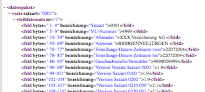

= Export

Der Export eines Datenpakets ist relativ simpel:

[source:java]
----
datenpaket.export(file);
----

Statt _file_ ist auch die Angabe eines Writers oder eines OutputStreams möglich.
Ein Beispiel dafür findest du unter
link:../../lib/src/test/java/gdv/xport/DatenpaketTest.java[DatenpaketTest].

Normalerweise wird jeder Datensatz und Teildatensatz mit einem Zeilenende abgeschlossen.
Über

[source]
----
-Dgdv.eod=
----

kann auch ein anderes Zeichen (oder Zeichenkette) eingestellt werden.

== Einzel-Export

Ein einzelner Datensatz kann ebenso direkt exportiert werden:

[source:java]
----
Datensatz satz100 = SatzRegistry.getInstance().getDatensatz(100);
...
satz100.export(file);
----

Dieses Beispiel findest du unter link:../../lib/src/main/java/gdv/xport/demo/ImportExport.java[ImportExport].

== Formatter

Zur Untersuchung des GDV-Formats und zur leichteren Fehlersuche gibt es den
link:../../lib/src/main/java/gdv/xport/util/XmlFormatter.java[XmlFormatter]
und link:../../lib/src/main/java/gdv/xport/util/HtmlFormatter.java[HtmlFormatter]
die ein Datenpaket nach XML bzw.HTML überführen und beide vom
link:../../lib/src/main/java/gdv/xport/util/AbstractFormatter.java[AbstractFormatter]
abgeleitet sind.

=== XML-Format

[source:java]
----
AbstractFormatter formatter = new XmlFormatter(new File("musterdatei.xml"));
formatter.write(datenpaket);
----

Dieser Ausschnitt formattiert das übergebene Datenpaket als XML und legt das Ergebnis in der Datei "musterdatei.xml" ab.

http://www.aosd.de/gdv.xport/musterdatei_041222.xml[]

=== HTML-Format

[source:java]
----
AbstractFormatter formatter = new HtmlFormatter(new File("musterdatei.html"));
formatter.write(datenpaket);
----

Tauscht man den link:../../lib/src/main/java/gdv/xport/util/XmlFormatter.java[XmlFormatter]
gegen den link:../../lib/src/main/java/gdv/xport/util/HtmlFormatter.java[HtmlFormatter]
aus, erhält man als Ergebnis eine HTML-Datei

http://www.aosd.de/gdv.xport/musterdatei_041222.html[image:img/export-html.png[HTML-Export]]
